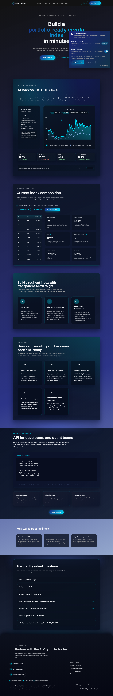
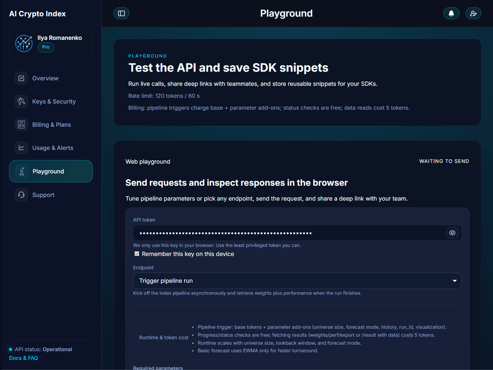
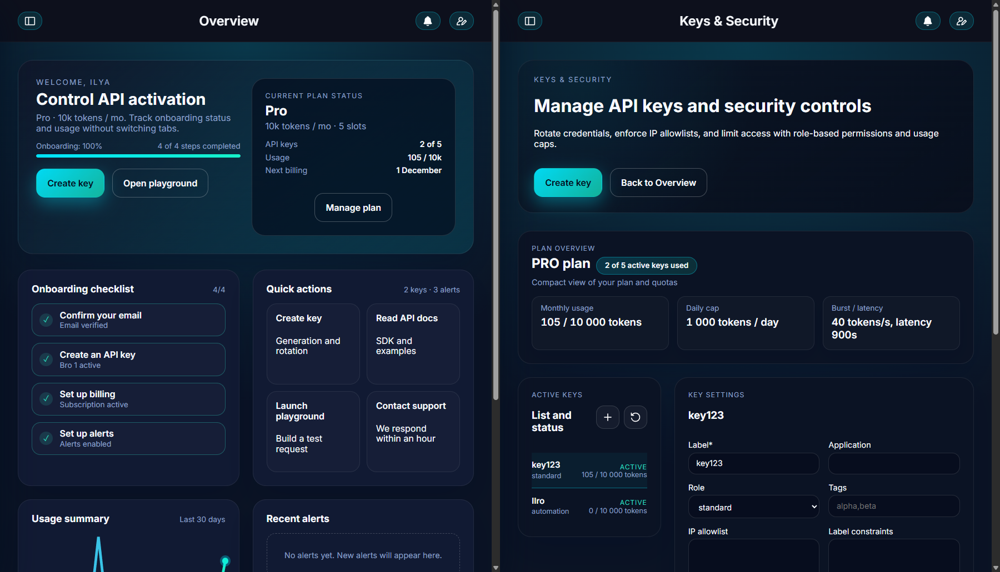
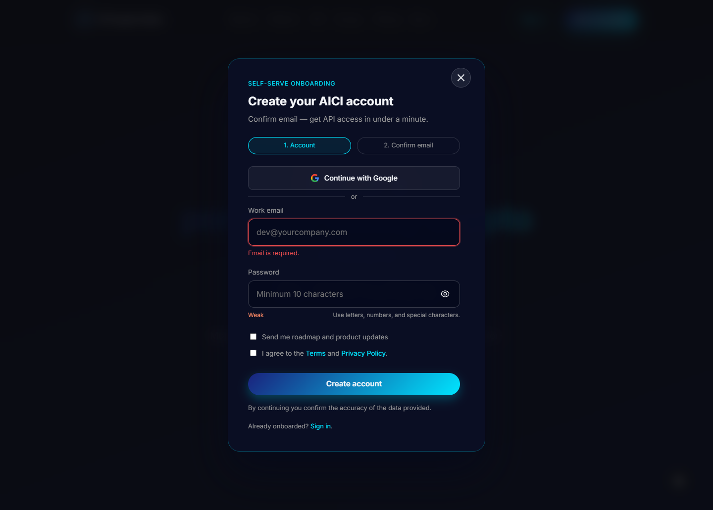

# AICI — AI-Powered Crypto Index

> An AI-driven cryptocurrency index that combines **hierarchical clustering**, **LSTM-based volatility forecasting**, and **risk-parity optimization** to build a balanced, diversified portfolio — delivered via a full-stack SaaS web application.

**Backtesting results (2021–2025):** ~31% CAGR · Sharpe ratio > 0.4

---

## Overview

AICI ingests market data from CoinMarketCap, clusters assets to reduce correlation, forecasts volatility with an LSTM model, and allocates weights via risk-parity optimization. Results are served through a FastAPI backend and a Jinja2/JS frontend with user auth, billing, and a playground dashboard.

```
Market Data → Clustering → LSTM Volatility → Risk-Parity Weights → Backtest → API + Dashboard
```

---

## UI Walkthrough

### Landing page
<!-- SCREENSHOT: Full-page screenshot of the landing page.
     Should show: hero section with headline + CTA button, the performance chart
     (equity curve comparing AICI vs BTC/ETH), the "How it works" steps block,
     and the pricing section. Ideal width: 1440px. Save as docs/screenshots/landing.png -->


---

### Interactive playground
<!-- GIF (or screenshot): The account playground at /app/playground.
     Show the full interaction: change parameters (n_top_coins, risk profile),
     hit "Run", watch the loading spinner, then see the result — equity curve chart,
     portfolio weights table, and performance metrics (CAGR, Sharpe, drawdown).
     A looping GIF ~15–20 s works best here. Save as docs/screenshots/playground.gif -->


---

### Account dashboard & API keys
<!-- SCREENSHOT: Two-panel collage or side-by-side:
     Left — /app/overview: shows active plan, usage stats, last run date.
     Right — /app/keys: shows an API key row (blur the actual key value)
     with copy/delete buttons. Save as docs/screenshots/account.png -->


---

### Auth flow
<!-- GIF (or screenshot): Open the login modal, switch to the register tab,
     then click "Continue with Google" — show the Google OAuth redirect.
     Keep it short (~8 s). Alternatively a static screenshot of the modal
     with the Google button visible is fine. Save as docs/screenshots/auth.png -->


---

## Tech Stack

| Layer | Technology |
|-------|-----------|
| **Backend** | Python 3.10, FastAPI, SQLAlchemy 2 (async), asyncpg |
| **Database** | PostgreSQL 15 |
| **ML / Quant** | TensorFlow 2.18 (LSTM), scikit-learn, pandas, numpy, scipy |
| **Auth** | JWT + refresh tokens, Google OAuth 2.0 (Authlib) |
| **Billing** | Stripe |
| **Frontend** | Jinja2 templates, vanilla JS, Node.js build pipeline |
| **Infrastructure** | Docker, docker-compose, Watchtower (auto-updates) |
| **Code quality** | Ruff, pytest |

---

## Local Setup (Docker)

### Prerequisites

- [Docker](https://docs.docker.com/get-docker/) + [Docker Compose](https://docs.docker.com/compose/)

### 1. Clone & configure

```bash
git clone https://github.com/ilya-romanenko/AI-Powered_Crypto_Index.git
cd AI-Powered_Crypto_Index

cp .env.example .env
# Edit .env — fill in POSTGRES_PASSWORD, JWT_SECRET, and any optional keys
```

### 2. Build and start

```bash
docker compose up --build
```

This starts two services:
- **`api`** — FastAPI app + pre-built frontend at `http://localhost:8000`
- **`auth-db`** — PostgreSQL 15

### 3. Open

```
http://localhost:8000
```

The API docs (Swagger UI) are available at `http://localhost:8000/docs`.

### Stop

```bash
docker compose down          # keep volumes
docker compose down -v       # also remove database volume
```

---

## Python Library Usage

Install as a library (no Docker required for the pipeline alone):

```bash
python -m venv .venv
# Windows:  .venv\Scripts\activate
# Linux/Mac: source .venv/bin/activate

pip install -e ".[dev]"
```

Run the full pipeline:

```bash
python -m ai_crypto_index.pipelines.main
```

Or from code:

```python
from ai_crypto_index.pipelines.main import run_monthly_update

weights, perf = run_monthly_update()
print(weights)   # dict: asset -> allocation weight
print(perf)      # dict: CAGR, Sharpe, max drawdown, etc.
```

---

## Data Policy & Tier Limits

| Setting | Free tier | Notes |
|---------|-----------|-------|
| `n_top_coins` | ≤ 200 | 100 uses cached daily snapshot (UTC) |
| Final asset count | ≤ 12 | Exceeding resets to defaults |
| Fresh data override | not supported for `n_top_coins=100` | Use a different value to fetch live data |

---

## Project Structure

```
src/ai_crypto_index/
├── fetch_data/       # CoinMarketCap ingestion & preprocessing
├── features/         # Technical & statistical indicators
├── forecast/         # LSTM volatility model
├── optimization/     # Clustering + risk-parity weights
├── risk/             # Covariance, correlation diagnostics
├── pipelines/        # End-to-end orchestration & backtesting
├── api/              # FastAPI app, routes, middleware
├── accounts/         # User auth (JWT, Google OAuth, bcrypt)
├── billing/          # Stripe integration
├── frontend/         # Jinja2 templates, static assets
└── shared/           # Settings, stores, notifications
tests/                # pytest smoke & pipeline tests
examples/             # Ad-hoc validation scripts
notebooks/            # Jupyter research notebooks
Results_Backup/       # Backtest equity curves & weights
```

---

## API Keys & Plans

After signing up at `/app`, navigate to **API Keys** to generate a key. Pass it as a bearer token:

```bash
curl -H "Authorization: Bearer <your-api-key>" \
     http://localhost:8000/api/v1/index/latest
```

---

## Contributing

Pull requests are welcome.

```bash
# Lint
ruff check .

# Tests
PYTHONPATH=src pytest
```

---

## License

[MIT](LICENSE)
